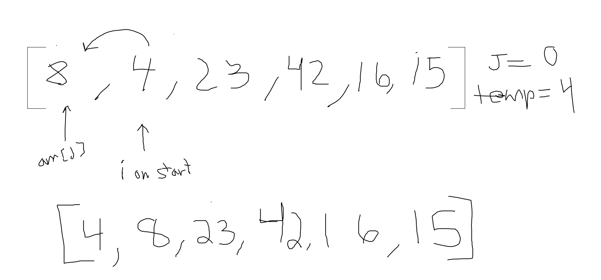
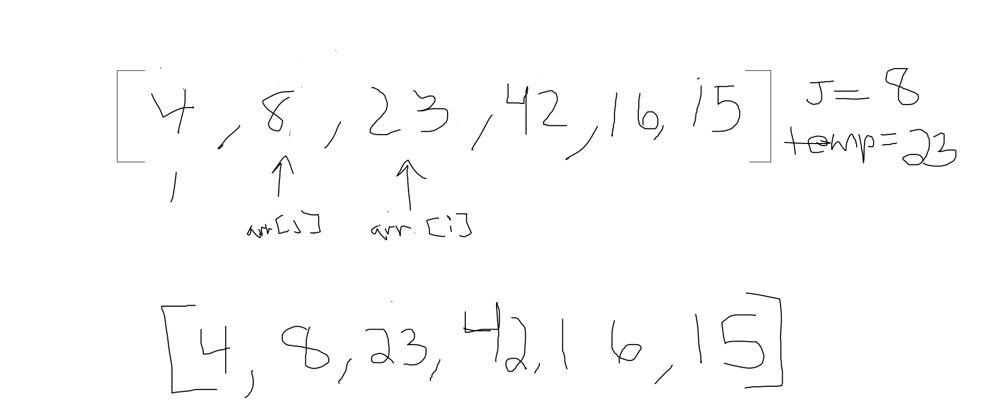
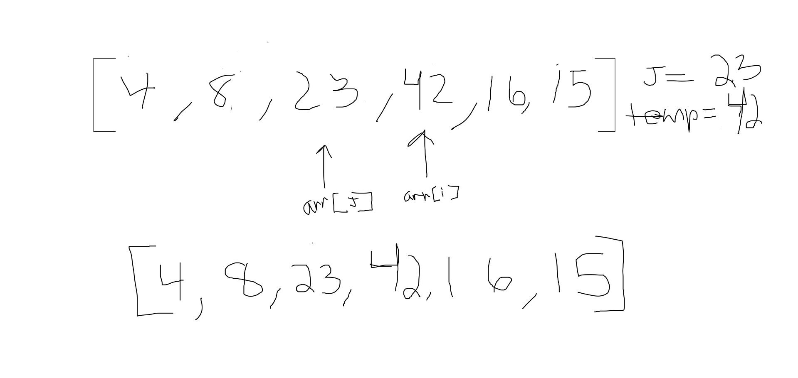
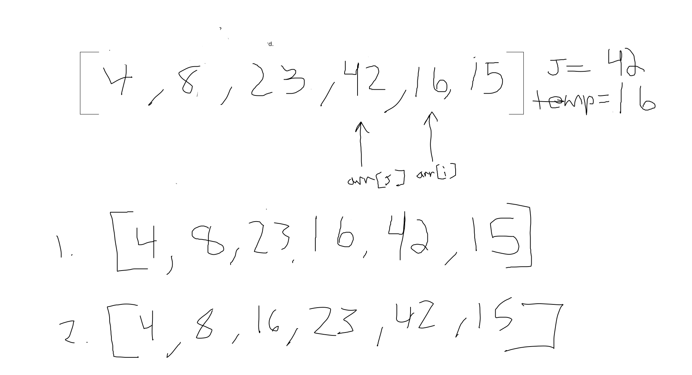
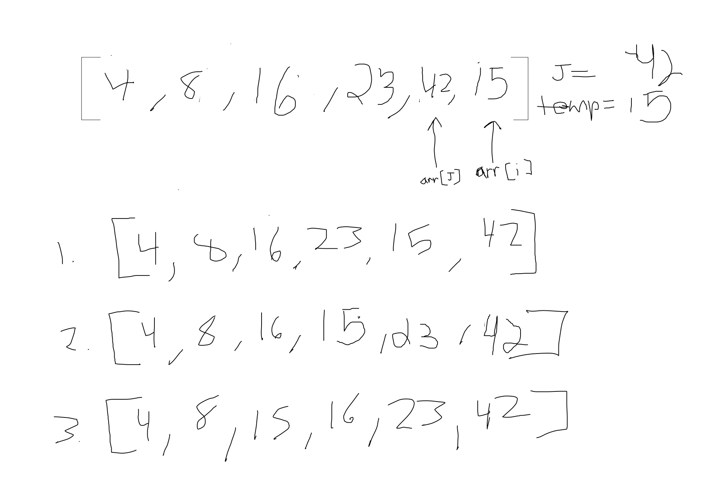

# Insertion Sort

###Pseudocode

 ```
InsertionSort(int[] arr)  
    FOR i = 1 to arr.length
    
      int j <-- i - 1
      int temp <-- arr[i]
      
      WHILE j >= 0 AND temp < arr[j]
        arr[j + 1] <-- arr[j]
        j <-- j - 1
        
      arr[j + 1] <-- temp
```
      
      
 ### Trace
 
 [8, 4, 23, 42, 16, 15]
 
 ###### Pass 1
 
 
 
 In the first pass through the insertion sort, we evaluated if there is a smaller number in the array
 than what is currently present in index 0 (8). We find this smaller number in index 1(4). The index's
 will swap values. It will recheck by updating "arr[j]" to the index in front of it to make sure there
  isn't
 another value at the current replaces value needs to jump ahead of. Since "4" is at the very front of
  the array we iterate through the next pass of the for loop.
  
  Ending array at end of first pass: `[4, 8, 23, 42, 16 ,15]`
 
   
 ###### Pass 2
 
  
  
  Second iteration starts at "23" and sets "arr[j]" to "8". Since these are in the right order the while
   loop will not be accesed and will iterate through to the next pass.
  

 ###### Pass 3
 
  
  
  Third iteration starts at "42" and sets "arr[j]" to "23". Since these are in order the while loop
   will not be accessed and iterate through to the next pass.
  
  
 ###### Pass 4
   
   
   
   Forth iteration starts at "16" and sets "arr[j]" to "42". The 16 is less than 42 so the while loop
    is accessed and the first swap occurs. While loop reassigns "arr[j]" to index in front of it and
     checks again until the original value is at index 2. 
    
 ###### Pass 5
     
   
    
    
   Final iteration starts at "15" and sets "arr[j]" to "42". The 15 is less than 42 so the while loop
   is accessed and the first swap occurs. While loop reassigns "arr[j]" to index in front of it and
   checks again until the original value is at index 2. 
   
   
 ### Efficency
 
   Time: O(n^2)
   The basic operation of this algorithm is comparison. This will happen n * (n-1) number of times…concluding the algorithm to be n squared.
   Space: O(1)
   No additional space is being created. This array is being sorted in place…keeping the space at constant O(1).

  
 
      