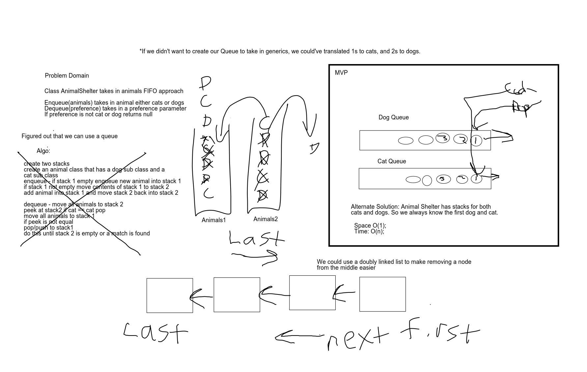

# AnimalShelter
<!-- Short summary or background information -->
- Create AnimalShelter class
- enqueue(animal) inserts animal value for cat or dog
- dequeue(preference) extracts value dog, cat or null
## Challenge
<!-- Description of the challenge -->
- AnimalShelter holds only dogs and cats. FIFO. To dequeue kept track of the Node in front and behind it so that the first dog or cat could be returned. If request is not for dog or cat then null is returned. 

## Approach & Efficiency
<!-- What approach did you take? Why? What is the Big O space/time for this approach? -->
Double Linked list tracking front and back not to pull out from a queue. 

O(n) Time 
O(1) Space

## Solution
<!-- Embedded whiteboard image -->
