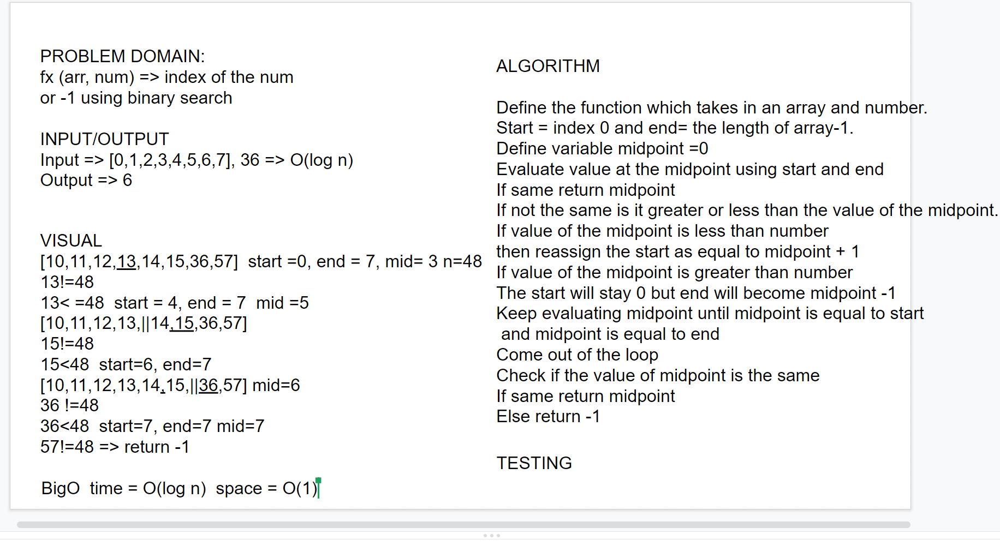

# Binary Search
<!-- Short summary or background information -->
 [4,8,15,16,23,42], 15  to 2

## Challenge
<!-- Description of the challenge -->
write a function called BinarySearch which takes in 2 parameters: a sorted array and the search key. return index of the array's element that is equal to the search key or -1 if the element does not exist.

## Approach & Efficiency
<!-- What approach did you take? Why? What is the Big O space/time for this approach? -->
Define the function which takes in an array and number.
Start = index 0 and end= the length of array-1.
Define variable midpoint =0
Evaluate value at the midpoint using start and end
If same return midpoint 
If not the same is it greater or less than the value of the midpoint.
If value of the midpoint is less than number
then reassign the start as equal to midpoint + 1
If value of the midpoint is greater than number
The start will stay 0 but end will become midpoint -1
Keep evaluating midpoint until midpoint is equal to start
 and midpoint is equal to end
Come out of the loop 
Check if the value of midpoint is the same
If same return midpoint
Else return -1

BigO time = O(log n) space = O(1)

## Solution
<!-- Embedded whiteboard image -->
