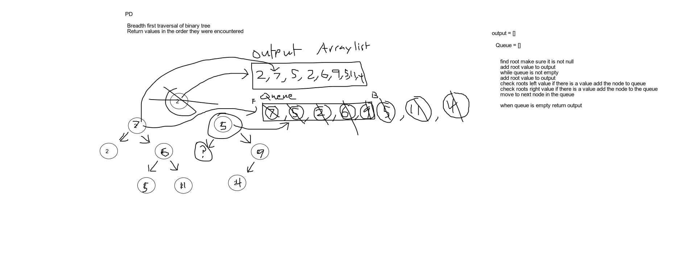

# Breadth First
<!-- Short summary or background information -->
- Breadth first traverse of a binary tree and return list of values in the tree in the order they were encountered

## Challenge
<!-- Description of the challenge -->
- Breadth first traversal of binary tree and return values in order as they are encountered.
- Without utilizing any of the built in methods.

## Approach & Efficiency
<!-- What approach did you take? Why? What is the Big O space/time for this approach? -->
Created a method BreathFirstTraversal that traversed the tree from the root.
Adds value of current to output. 
While loop that checks for left value and right value and add to the queue. 
Adds each time the current to output.

O(n) Time 
O(n) Space

## Solution
<!-- Embedded whiteboard image -->
