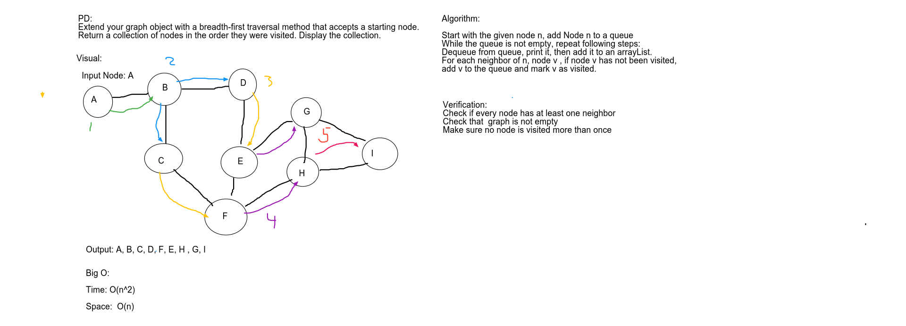

# Breadth First Graph
- Breadth first traverse of a graph and return list of nodes in the order they were
 visited

## Challenge
- Extend your graph object with a breadth-first traversal method that accepts a starting node.
- Without utilizing any of the built-in methods available to your language,
- Return a collection of nodes in the order they were visited. Display the collection.

## Approach & Efficiency
<!-- What approach did you take? Why? What is the Big O space/time for this approach? -->
Created a method BreathFirstTraversal that starting with a node traversed in the order they were visited. Checking to not visit the same node twice.

O(n^2) Time 
O(n) Space

## Solution

