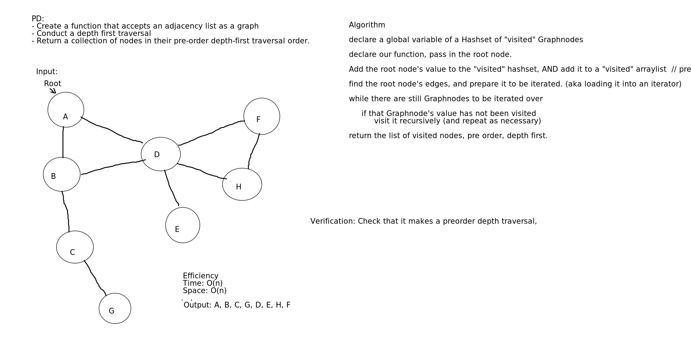

# Depth First Graph
- Create a function that accepts an adjacency list as a graph and returns a collection of nodes in their
 pre-order depth-first traversal order

## Challenge
- Create a function that accepts an adjacency list as a graph
- Conduct a depth first traversal
- Return a collection of nodes in their pre-order depth-first traversal order

## Approach & Efficiency
Called a function depthFirstPreOrder the used a helper function to visit each node and check. It
 returns a list of vertexes values in preorder of being visited. Takes in a starting node recurses
  using the helper function to find all nodes that haven't been visited.
  
  https://www.geeksforgeeks.org/depth-first-search-or-dfs-for-a-graph/#:~:text=%2520Solution%253A%2520%25201%2520Approach%253A%2520Depth-first%2520search%2520is,node%2520as%2520visited%2520and%2520print%2520the...%2520More%2520

O(n^2) Time 
O(n) Space

## Solution

