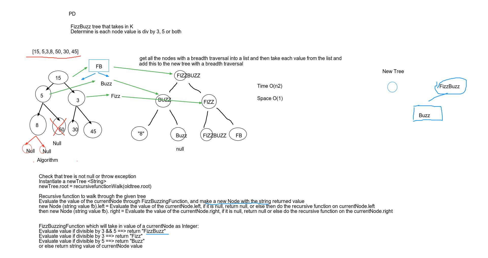

# Fizz Buzz
<!-- Short summary or background information -->
- Write a function FizzBuzzTree that takes a k-ary tree as an argument.
Determine if value of each node is divisible by 3, 5, or both. 
Create new tree with same structure but values changes to "Fizz", "Buzz" or "FizzBuzz"

## Challenge
<!-- Description of the challenge -->
- traversal of binary tree and return new tree with new values.
- Without utilizing any of the built in methods.

## Approach & Efficiency
<!-- What approach did you take? Why? What is the Big O space/time for this approach? -->
Created a fizzBuzzingFunction to return new value.
Recursive function to walk the tree left and right.
fizzBuzzTree created new tree and returns the new tree.

O(n) Time 
O(n) Space

## Solution
<!-- Embedded whiteboard image -->
