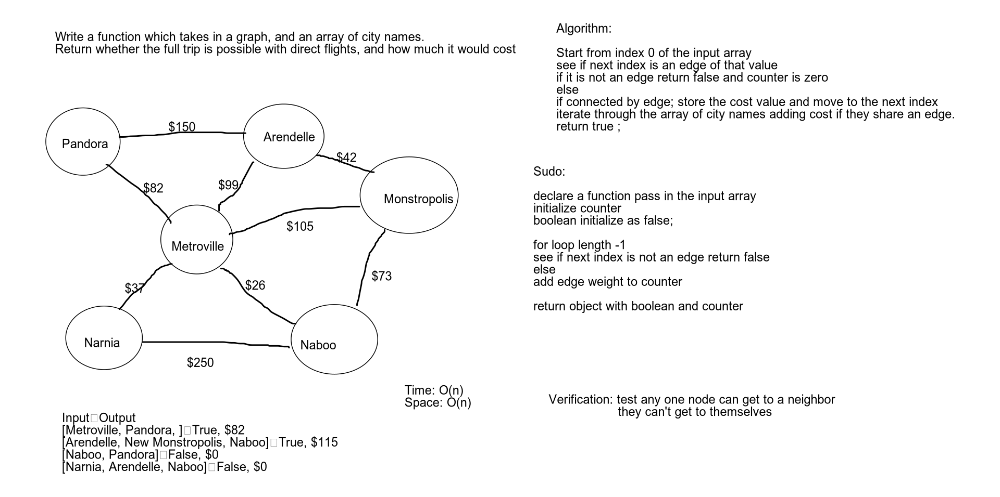

# Get Edge Graph
- Traverse a graph with an array of city names and return true with the total cost if the cities
 listed are connected by direct path from one to the next.

## Challenge
- Write a function which takes in a graph, and an array of city names.
- Without utilizing any of the built-in methods available to your language
- Return whether the full trip is possible with direct flights, and how much it would cost.

## Approach & Efficiency
- called a function takeATrip passing a string array as input. set a counter to 0. Had for loops into
 for loops so not the best with the Big O but got the output we were looking for. 

O(n^2) Time 
O(n) Space

## Solution

