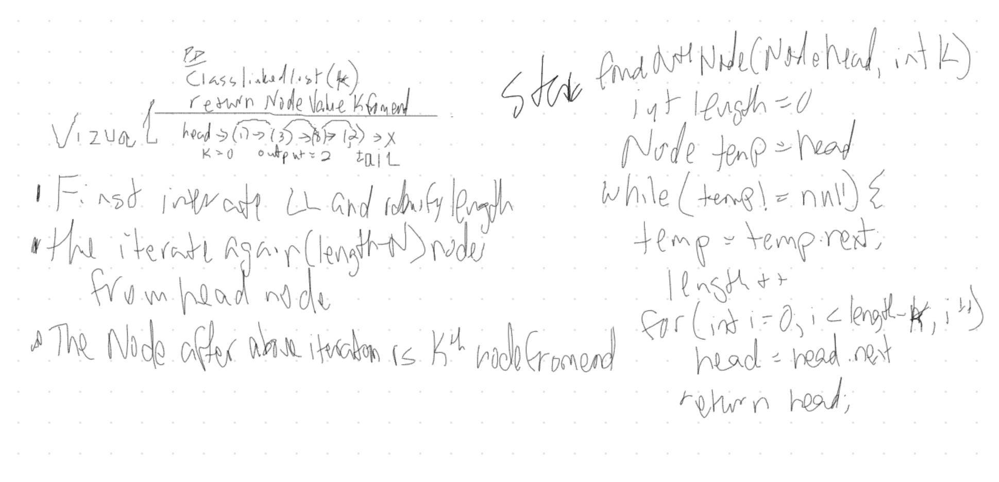

# Linked List insertions
<!-- Short summary or background information -->
Find K from the End
 head->{1}->{3}->{8}->{2}->X [0]  to Output 2
 head->{1}->{3}->{8}->{2}->X  [2] to Output 3
 head->{1}->{3}->{8}->{2}->X [6] to Output Exception

## Challenge
<!-- Description of the challenge -->
Write a method for the Linked List class which takes a number L as a parameter. Return the node's value is K from the end of the linked list.

## Approach & Efficiency
<!-- What approach did you take? Why? What is the Big O space/time for this approach? -->
O(n);
Start at head and iterate through to find the length. Move back the value to return Node

## Solution
<!-- Embedded whiteboard image -->

