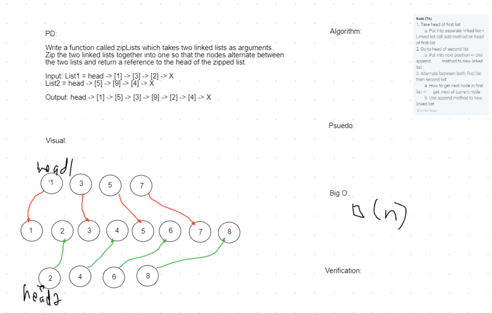

# Linked List Zipped
<!-- Short summary or background information -->
Write a function called zipLists which takes two linked lists as arguments.
Zip the two linked lists together into one so that the nodes alternate between the two lists and return a reference to the head of the zipped list.

head->{1}->{3}->{6}->{8}->X [5]  to head->{2}->{4}->{6}->{8}->{5}->X
 
Insert new value before given value
head->{2}->{4}->{6}->{8}->X  [4,5] to head->{2}->{5}->{4}->{6}->{8}->X

Insert new value after given value
 head->{2}->{4}->{6}->{8}->X [4,5] to head->{2}->{4}->{5}->{6}->{8}->X

## Challenge
<!-- Description of the challenge -->
Keep track of the nodes without losing other nodes

## Approach & Efficiency
<!-- What approach did you take? Why? What is the Big O space/time for this approach? -->
O(n);
Find tail node and keep track of that while replacing tail node with new node.
Find given value and insert new value before or after. Used .next and reassigned current value.

## Solution
<!-- Embedded whiteboard image -->
