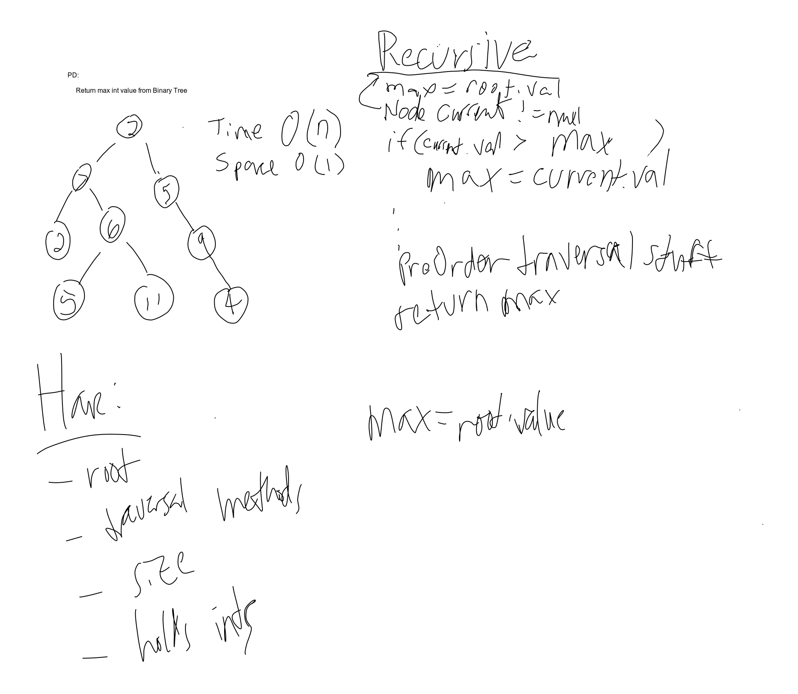

# PseudoQueue
<!-- Short summary or background information -->
- Traverse a binary tree and return max value

## Challenge
<!-- Description of the challenge -->
- Traverse binary tree and return max value. Without utilizing any of the built in methods.

## Approach & Efficiency
<!-- What approach did you take? Why? What is the Big O space/time for this approach? -->
Created a method findMaxHelper() that traversed the tree and passed max to the findMaxValue()

O(n) Time 
O(1) Space

## Solution
<!-- Embedded whiteboard image -->
