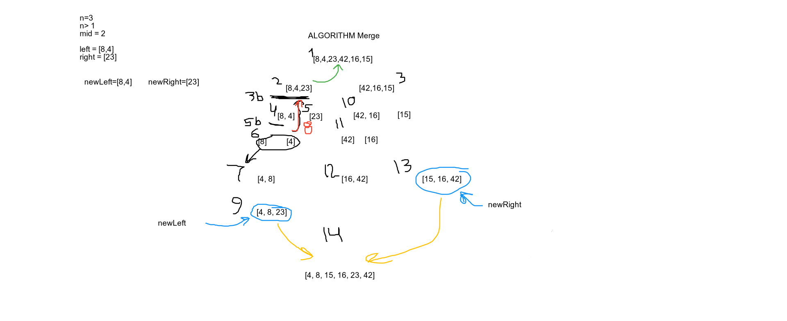

# Merge Sort

###Pseudocode

 ```
ALGORITHM Mergesort(arr)
    DECLARE n <-- arr.length
           
    if n > 1
      DECLARE mid <-- n/2
      DECLARE left <-- arr[0...mid]
      DECLARE right <-- arr[mid...n]
      // sort the left side
      Mergesort(left)
      // sort the right side
      Mergesort(right)
      // merge the sorted left and right sides together
      Merge(left, right, arr)

ALGORITHM Merge(left, right, arr)
    DECLARE i <-- 0
    DECLARE j <-- 0
    DECLARE k <-- 0

    while i < left.length && j < right.length
        if left[i] <= right[j]
            arr[k] <-- left[i]
            i <-- i + 1
        else
            arr[k] <-- right[j]
            j <-- j + 1
            
        k <-- k + 1

    if i = left.length
       set remaining entries in arr to remaining values in right
    else
       set remaining entries in arr to remaining values in left

```
    
      
 ### Trace
 
 [8, 4, 23, 42, 16, 15]


Set n to the length of the array

if n is greater than 1

set mid = n/2
set left = first half of array
set right = second half array

run Mergesort(left) to sort the left array this will continue to sort until one value remains in each
 array
run Mergesort(right) to sort the right array this will contine to sort until one value remains in each
 array
Mergesort(left, right, arr) to merge the sorted left and right together and return sorted array
 
 
 
 
 ###### Pass 1
  
 In the first pass through the insertion sort, we evaluated if there is a smaller number in the array
 than what is currently present in index 0 (8). We find this smaller number in index 1(4). The index's
 will swap values. It will recheck by updating "arr[j]" to the index in front of it to make sure there
  isn't
 another value at the current replaces value needs to jump ahead of. Since "4" is at the very front of
  the array we iterate through the next pass of the for loop.
  
  Ending array at end of first pass: `[4, 8, 23, 42, 16 ,15]`
 
 ###### Pass 2
 
  Second iteration starts at "23" and sets "arr[j]" to "8". Since these are in the right order the while
   loop will not be accesed and will iterate through to the next pass.
  
 ###### Pass 3
 
  Third iteration starts at "42" and sets "arr[j]" to "23". Since these are in order the while loop
   will not be accessed and iterate through to the next pass.
  
 ###### Pass 4
      
   Forth iteration starts at "16" and sets "arr[j]" to "42". The 16 is less than 42 so the while loop
    is accessed and the first swap occurs. While loop reassigns "arr[j]" to index in front of it and
     checks again until the original value is at index 2. 
    
 ###### Pass 5 
    
   Final iteration starts at "15" and sets "arr[j]" to "42". The 15 is less than 42 so the while loop
   is accessed and the first swap occurs. While loop reassigns "arr[j]" to index in front of it and
   checks again until the original value is at index 2. 
      
 ### Efficency
 
   Time: O(n log n)
   It will be less space you won't have to itterate over them again so more efficient on speed
   . Without a nested for loop you won't be at n squared
   Space: O(log n)
   Will have as many spaces as what you are itterating over n + however many values are in the array.
   