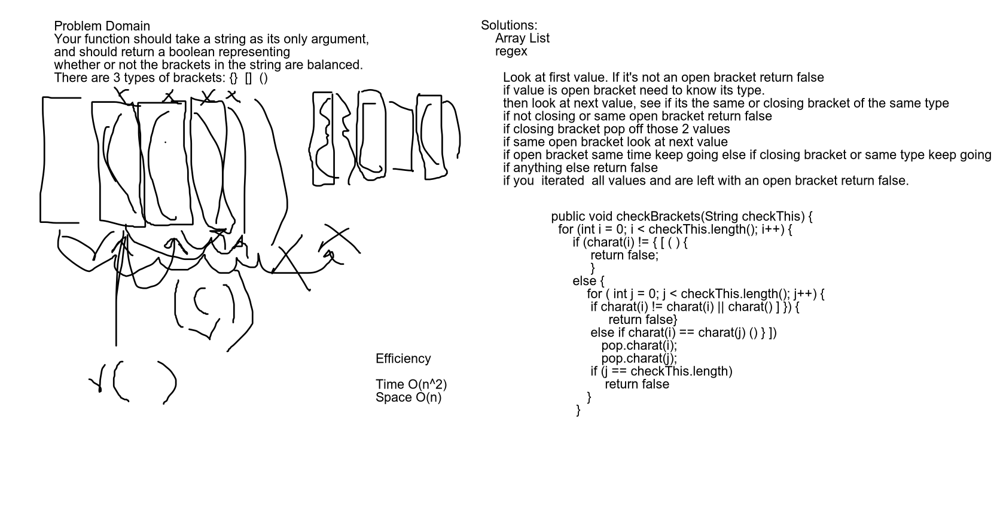

# MultiBracketValidation
<!-- Short summary or background information -->
- function should take in a string as its only argument nad return a boolean representing whether or not the brackets in the string are balanced. 
## Challenge
<!-- Description of the challenge -->
- Match up braces open and close with no other bracket types in between. 

## Approach & Efficiency
<!-- What approach did you take? Why? What is the Big O space/time for this approach? -->
We added some regex. First made sure about empty and starting with open bracket setting to false. Iterated through to find first open bracket. Looked to match with a closing bracket. Complete for each type of bracket. 

O(n^2) Time 
O(n) Space

## Solution
<!-- Embedded whiteboard image -->
