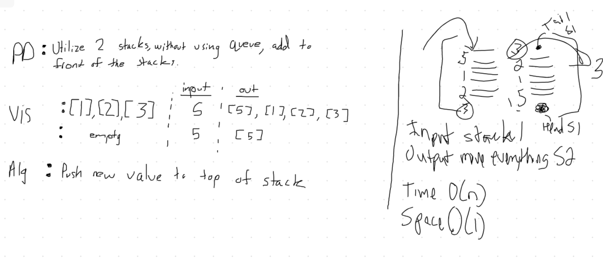
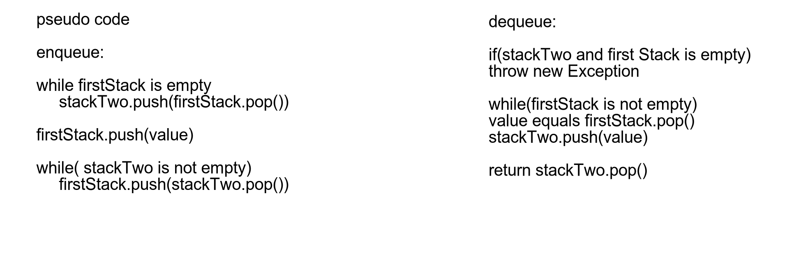

# PseudoQueue
<!-- Short summary or background information -->
- Create PseudoQueue class
- Stack class with methods push, pop, peek, isEmpty
- enqueue(value) inserts value
- dequeue() extracts value
## Challenge
<!-- Description of the challenge -->
- Insert value into stack. to dequeue you must move the values to another stack to pull the value from the new top. 

## Approach & Efficiency
<!-- What approach did you take? Why? What is the Big O space/time for this approach? -->

O(n) Time 
O(1) Space

## Solution
<!-- Embedded whiteboard image -->
;
;
