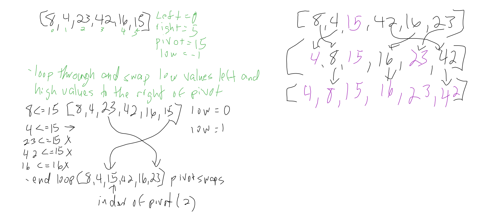

# Quick Sort

Quick sort takes a value from the array called pivot and using it as a reference for a series of swaps. Any value lower than pivot value gets swapped to the left of pivot and then pivot adds to the end of the lower values. The quick sort needs to run left and right of the pivot recursively to finish the sort.

###Pseudocode

 ```
ALGORITHM QuickSort(arr, left, right)
    if left < right
        // Partition the array by setting the position of the pivot value 
        DEFINE position <-- Partition(arr, left, right)
        // Sort the left
        QuickSort(arr, left, position - 1)
        // Sort the right
        QuickSort(arr, position + 1, right)

ALGORITHM Partition(arr, left, right)
    // set a pivot value as a point of reference
    DEFINE pivot <-- arr[right]
    // create a variable to track the largest index of numbers lower than the defined pivot
    DEFINE low <-- left - 1
    for i <- left to right do
        if arr[i] <= pivot
            low++
            Swap(arr, i, low)

     // place the value of the pivot location in the middle.
     // all numbers smaller than the pivot are on the left, larger on the right. 
     Swap(arr, right, low + 1)
    // return the pivot index point
     return low + 1

ALGORITHM Swap(arr, i, low)
    DEFINE temp;
    temp <-- arr[i]
    arr[i] <-- arr[low]
    arr[low] <-- temp
```    
      
 ### Trace
 
 [8, 4, 23, 42, 16, 15]
 
 ###### Pass 1
 
 In the first pass through the insertion sort the pivot is the right most value, 15. The first value is compared to pivot and it's lower. Same happens with 4. The next 3 values are higher than pivot so the pivot is then swapped with the first higher value, 23. Now 15 is the sorted. 
  
  Ending array at end of first pass: `[8, 4, 15, 42, 16 ,23]`


 The same process continues to the left and right of pivot. Pivot for the left is 4 which is then swapped with 8. 8 is then the pivot but because its right and left resolve it moves on.

 The process continues on the right side with pivot being 23. 16 swaps left and 42 swaps right. Next round 16 and 42 resolves. 
 
  
 
   
 ### Efficency
 
   Time: O(nlogn)
   Space: O(logn)
   
   