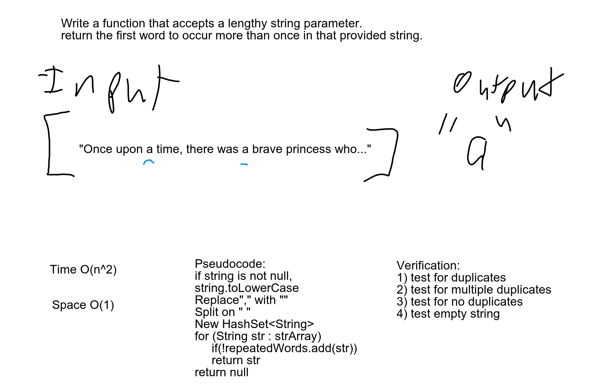

# Repeated Word
<!-- Short summary or background information -->
return first duplicate word from a string

## Challenge
<!-- Description of the challenge -->
Write a function that accepts a lengthy string parameter.
Return the first word to occur more than once in that provided string.

## Approach & Efficiency
<!-- What approach did you take? Why? What is the Big O space/time for this approach? -->
If the string is not null, we modified the string to lowercase and removed all comma's. Used regex to
separate the words at the spaces. Used a Hashset to loop through the strings and return the
 first duplicate word. Throws exception if no repeated word exists in the string. 

O(n^2) Time 
O(1) Space

## Solution
<!-- Embedded whiteboard image -->
