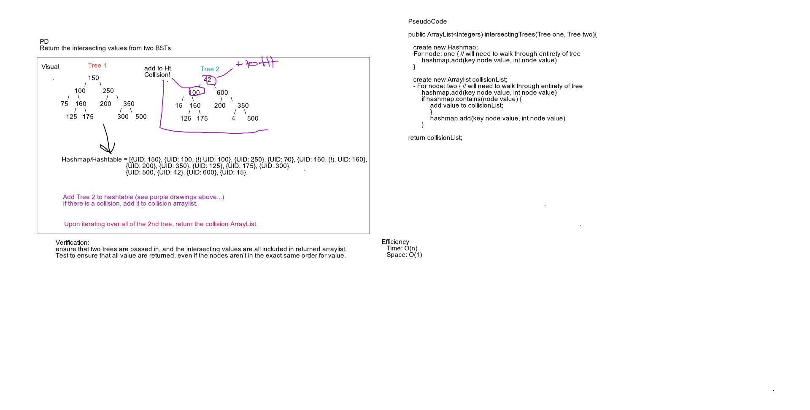

# Tree Intersection
<!-- Short summary or background information -->
Write a function that takes two binary tree parameters and returns a set of values found in both trees.

## Challenge
<!-- Description of the challenge -->
Write a function called tree_intersection that takes two binary tree parameters.
Without utilizing any of the built-in library methods available to your language, return a set of values found in both trees.

## Approach & Efficiency
<!-- What approach did you take? Why? What is the Big O space/time for this approach? -->
Created an array list to hold the collision list. Took time to build Node and Tree with preOrder
 search. Created new Hashmap. Throw exception if tree is null. Itterate through and store first tree
  in Hashmap. Itterate next tree when a collision occurs that is returned to collision list array. 
 
O(n) Time 
O(1) Space

## Solution
<!-- Embedded whiteboard image -->
